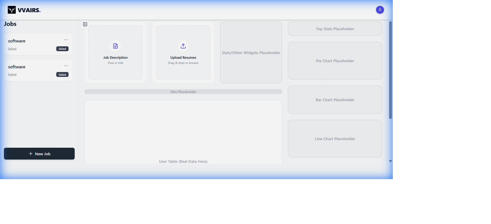
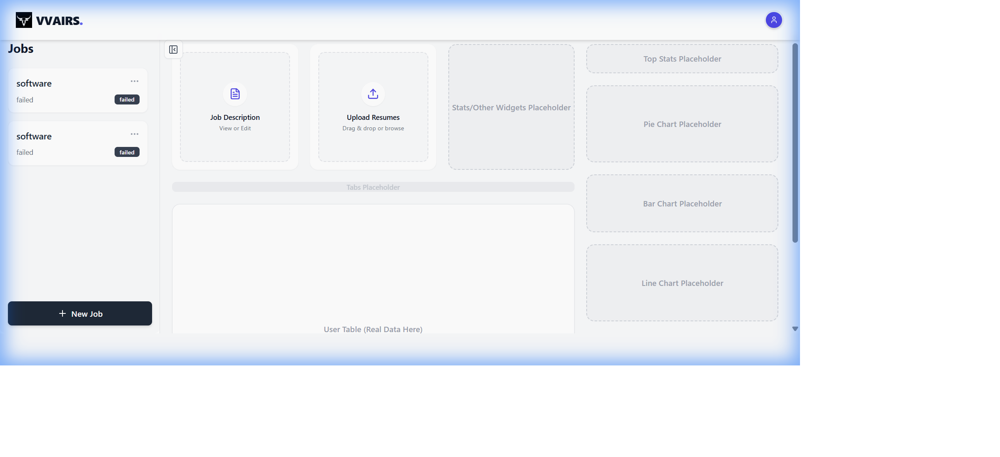
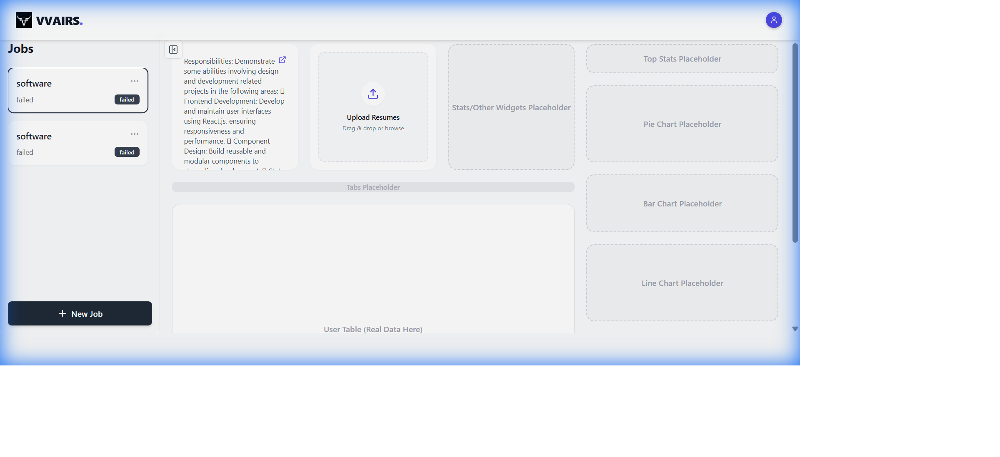
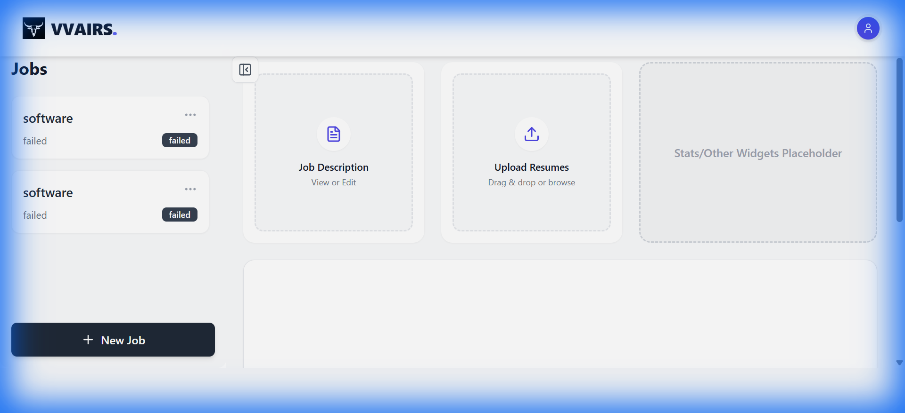
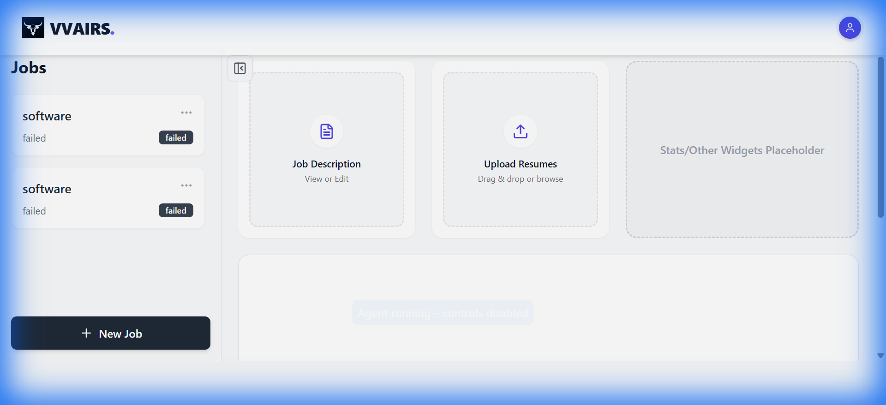

# UI Refactoring Documentation

This document summarizes the changes made to the Dashboard UI to optimize space, improve layout, and enhance responsiveness.

## 1. New Dashboard Layout & Sidebar
- **Moved Jobs List**: The "Jobs" list has been moved from the main grid to a dedicated left sidebar (`w-80`), freeing up horizontal space.
- **Square Widgets**: `JobDescription` and `ResumeUploader` are now square (`aspect-square`) to save vertical space.
- **Component Refactoring**: Simplified headers and content for a more compact look.

## 2. Responsive Behavior & Fixed Stats
- **Collapsible Sidebar**: Added a toggle button to show/hide the sidebar.
- **Responsive Expansion**: When the sidebar closes, the middle column (widgets/table) expands to fill the available space.
- **Fixed Stats Column**: The right column (stats/charts) remains at a fixed width (`w-80`), ensuring charts don't stretch unnaturally.

## 3. Job Description Improvements
- **Text Filling**: Removed the `line-clamp` constraint. The text now fills the entire available height of the widget, utilizing the space effectively.

## 4. Final Layout Polish
- **Removed Line Chart**: The Line Chart placeholder has been removed to reduce clutter.
- **Smaller Charts**: The right column width was reduced to `w-80`, making the remaining Pie and Bar charts smaller and square (`aspect-square`), giving more prominence to the main content.

## 5. Initial Design (Reference)
For comparison, here is the initial implementation of the collapsible sidebar before the stats column was fixed.

